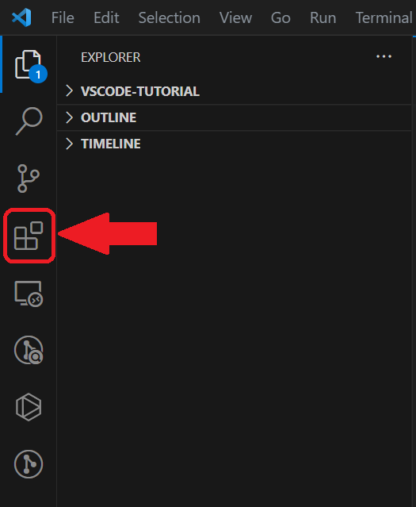
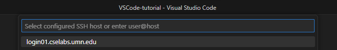
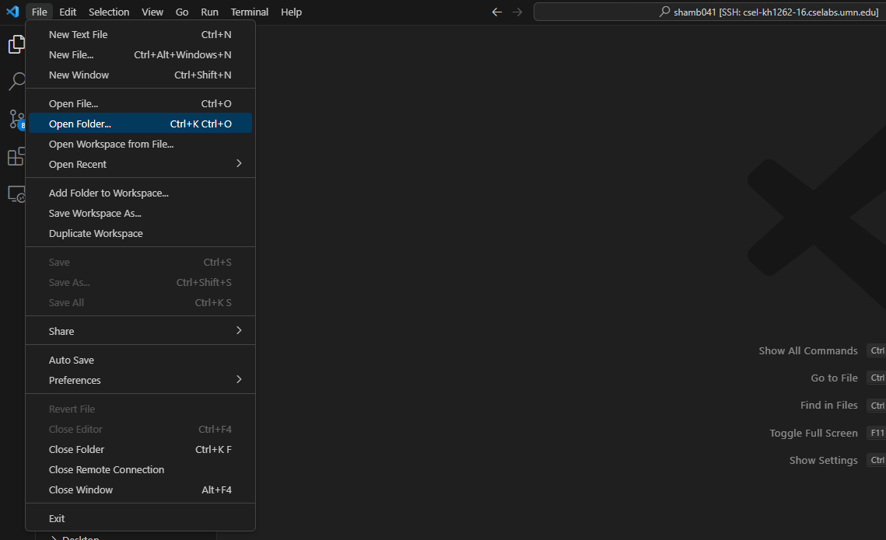
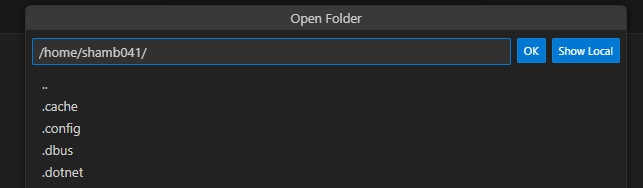
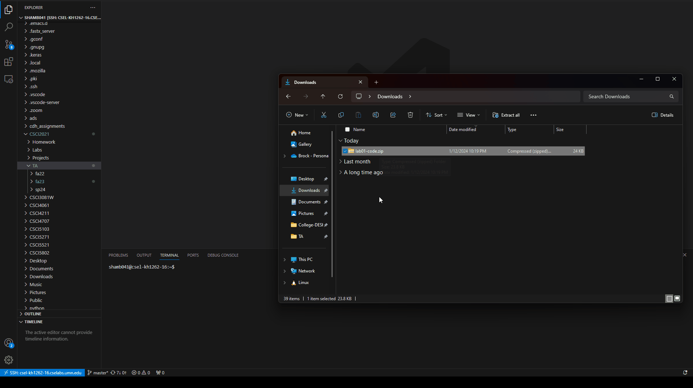

> Most of this tutorial comes from a previous TA of CSCI 2021, [Tien Dinh](https://tienpdinh.com/posts/remote-vscode)

# Remote Editing with VS Code

There are numerous reasons why you would want to set up a pipeline which allows you to remotely edit codes on a server. In this tutorial, I will walk through the steps needed to set up VS Code for remote editing, as well as some tips I found useful that will help you have a better experience with VS Code. **Make sure you read the entire document**

***For CSCI 2021:*** *Remote editing is very beneficial because you don’t have to install any special software or extension on your own computer (except VS Code). VS Code also has a built-in terminal that you can use to run your code from the remote machine you’re currently editing on.*

## VS Code
### Download
VS Code can be downloaded from the Microsoft website [here](https://code.visualstudio.com/). Make sure you download the version compatible with your OS.

You might want to get yourself familiar to VS Code if you haven’t used it before. This is a great text editor that offers many different features which can help enhance your coding experiences. You can have a look at Microsoft’s [tutorial](https://code.visualstudio.com/docs/introvideos/basics) if you feel the need for it, this tutorial only focuses on remote editing capability of VS Code.

### Installing VS Code Remote extensions

Open up VS Code, on the left panel, click on the extensions tab:



Search for “remote development” and install the package from Microsoft remote-dev:


You can also have a look at this extension on the VS Code website: [Remote Development](https://marketplace.visualstudio.com/items?itemName=ms-vscode-remote.vscode-remote-extensionpack)

After installing the extensions, you might have to close and reopen VS Code. If the installation process completed without any error, you should see a little blue (or maybe green or purple) icon appear at the lower left corner of VS Code:


Clicking on this icon will bring up the setup for Remote Development: 


At this point, you need to decide what machine you want VS Code to connect to when doing remote editing. Most CSE lab machines will work, as long as they are running Linux. A full list of CSE lab machines can be found [here](https://cse.umn.edu/cseit/classrooms-labs). In this example, I will use `login01.cselabs.umn.edu` as the destination machine. You can use the same machine if you want.

First you need to make sure you can ssh to this machine, open a new Terminal session and type in the following command:

```
ssh x500@machine
```

Remember to replace `x500` with your x500 and `machine` with the address of the machine you want to connect to. In my case this command would be **(Use your own X500, not `shamb041`)**:

```
ssh shamb041@login01.cselabs.umn.edu
```

You might get something like this when you first connect to a particular remote machine:

```
The authenticity of host 'login01.cselabs.umn.edu (128.101.38.193)' can't be established.
RSA key fingerprint is SHA256:hC61Slow+2OYpHeMb9idGs6w25DIDD/dRnT4lbo9TW8.
Are you sure you want to continue connecting (yes/no)? 
```

Just type `yes` and hit enter, it will let you enter your password. *Note that you won’t be able to see anything on the screen while you type your password.* This password is the same one that you use for MyU.

If you see something like this, it means you have successfully connected to the desired remote machine:

```
Last login: Fri Jun 12 23:02:09 2020 from x.x.x.x
shamb041@csel-login01:/home/shamb041 $ 
```

Back to VS Code, open up the Remote Development menu and select “Remote-SSH: Connect to Host…”. Then click “Add New SSH Host…”. At this point you want to enter the same command you used to connect to the remote machine, in my case, it would be:


Hit Enter until the lower right of VS Code shows a notification saying it has successfully added the host.

Now if you open up Remote Development menu and hit “Remote-SSH: Connect to Host…” again, the host you just added will show up as an option:



Click on this host, the log will ask for your password, put in your password and wait a little bit until the log settles, that’s when you know the connection is successful. You might have to select the destination platform the first time you connect, just select Linux: 


Due to issues with Duo authentication, it might appear to ask you for your password multiple times during the login process. If this happens, click the `terminal` tab at the bottom of the screen to see if it is asking for Duo. If so, type directly into the terminal to do your normal Duo authentication and you can enter a blank password if the popup at the top of the screen is still there.

If the log shows something like below, the connection is successful:

```
13bf30366675: start
sshAuthSock====
agentPort==33565==
osReleaseId==ubuntu==
arch==x86_64==
webUiAccessToken====
tmpDir==/run/user/2363563==
platform==linux==
13bf30366675: end
```

You can also check the status of the connection by looking at the lower left corner of VS Code, in this case it should show:


At this point, VS Code is in remote development mode. You can hit File->Open to open directories or files you have on the remote machine.

## Password-free Remote Development

It is very frustrating when you have to enter your password everytime you connect to the remote server. By creating a SSH key, you can authorize your machine (and at the same time, VS Code) to connect without password.

**ONLY do this on your personal computer, with SSH key authorization, anyone will be able to connect to your CSELab home directory without your password.**

First create a SSH key on your computer if you haven’t done so, open up Terminal **on your local machine** and type:

```
ssh-keygen -t rsa -b 4096 -C "YOUR_INTERNET_ID@umn.edu"
```
Be sure to replace `YOUR_INTERNET_ID@umn.edu` with your actual university email.

The following will show up in your terminal. Press enter when you are asked where to save your SSH key. This will save it in the default location.

```
Generating public/private rsa key pair.
Enter file in which to save the key (~/.ssh/id_rsa):
Created directory '~/.ssh'.
```

When you are prompted to enter a passphrase, press enter again.

```
Enter passphrase (empty for no passphrase):
Enter same passphrase again:
```

You should now have two keys saved in `~/.ssh`:

`id_rsa` - This is your **private** key and should be kept secret. Do not share this with anyone or put this on the internet.

`id_rsa.pub` - This is your public key. It is safe to share this, and it can be used to identify you uniquely when logging in.

You can obtain your public key by:

```
cat ~/.ssh/id_rsa.pub
```

Or by opening the `~/.ssh/id_rsa.pub` with the text editor of your choice. On Windows, for example, the full path to this file should be something like `C:\Users\<username>\.ssh\id_rsa.pub`

For example, my public key is:

```
ssh-rsa AAAAB3NzaC1yc2EAAAADAQABAAACAQDVmFg+PcpbBIID8SjmzSvjiTq+5x2dRpyWGwq3PFR+ZGDIg76Xi6/yf7Q65zmribyJeD0N3ik/9Nbs+DB7VTE1gAHm+yv+5AdZA5VUFbvxSO3jWcLGm3vxN1TTUNHsiJ09j/tlwzbNzji/59IBNlFApy+2HX7Iua7qJ/xcsyeIOtkuSCfNBZFUZ80itFwTcLM/jbRPF1UUJkQJmW6D1qFmbSodCRCMLBg98PW7iIhQ1B59Fi8kBKppveKybj9TdCVcTWNMU3uSsHfZOqS7ZGWjBnnf/nR/vT9/Qb2Rc+03zOAtzS9M6salIN3Smgaqit4rsKpOStUMpATZ231+5/4Uazso6Jy67rwcYFkhVJRRpQuqoXv7K6sCUCxUz+9+4TMLB8srylNfXeZdezUEORNXlffObNA6DbQ5b9mOQtUoFC3JQ6PVy7a84ZO3uaVU3s2porOfdJap9B3f6cltSCyIpKxivPlwy7K7uytMp0JvStHvaTWyhoAFygv21s6hKnAma853pXS9IDA7xHeHNq9b+CoAjv+ZsPHriFabr/N39VtXTOIJvkFTVi8155kdBjEUg4Yg3g2QvPkGfy8gMvhWep7L3ujQIMo5eA/sBXg9p937NeN/5RZG2o0XOr7DMBuS5yzoJ54UD3EM4AzTrM2rDsJ7KzqQQNPSzLlqk47CAQ== shamb041@umn.edu
```

Now, log in to one of the CSE lab machines (doesn’t matter which one). Then `cd` to the `.ssh` directory. If this directory doesn’t exist, create it. You can create a directory with the `mkdir` command:

```
mkdir .ssh
```

Make sure this directory is world executable:

```
chmod 755 .ssh
```

`cd` to this directory, use `ls` to check if you have a file named `authorized_keys` already, if not, create this file using:

```
touch authorized_keys
```

Then you can append your public key to this file using:

```
echo "<your-key>" >> authorized_keys
```

Where `<your-key>` is what we copied from the `id_rsa.pub` file. The double quote is needed. For example, in my case it would be **(DO NOT COPY THIS, use your own public key)**:

```
echo "ssh-rsa AAAAB3NzaC1yc2EAAAADAQABAAACAQDVmFg+PcpbBIID8SjmzSvjiTq+5x2dRpyWGwq3PFR+ZGDIg76Xi6/yf7Q65zmribyJeD0N3ik/9Nbs+DB7VTE1gAHm+yv+5AdZA5VUFbvxSO3jWcLGm3vxN1TTUNHsiJ09j/tlwzbNzji/59IBNlFApy+2HX7Iua7qJ/xcsyeIOtkuSCfNBZFUZ80itFwTcLM/jbRPF1UUJkQJmW6D1qFmbSodCRCMLBg98PW7iIhQ1B59Fi8kBKppveKybj9TdCVcTWNMU3uSsHfZOqS7ZGWjBnnf/nR/vT9/Qb2Rc+03zOAtzS9M6salIN3Smgaqit4rsKpOStUMpATZ231+5/4Uazso6Jy67rwcYFkhVJRRpQuqoXv7K6sCUCxUz+9+4TMLB8srylNfXeZdezUEORNXlffObNA6DbQ5b9mOQtUoFC3JQ6PVy7a84ZO3uaVU3s2porOfdJap9B3f6cltSCyIpKxivPlwy7K7uytMp0JvStHvaTWyhoAFygv21s6hKnAma853pXS9IDA7xHeHNq9b+CoAjv+ZsPHriFabr/N39VtXTOIJvkFTVi8155kdBjEUg4Yg3g2QvPkGfy8gMvhWep7L3ujQIMo5eA/sBXg9p937NeN/5RZG2o0XOr7DMBuS5yzoJ54UD3EM4AzTrM2rDsJ7KzqQQNPSzLlqk47CAQ== shamb041@umn.edu" >> authorized_keys
```

Make sure this file is world readable:

```
chmod 644 authorized_keys
```

You now have a password-free SSH connection set up.

**NOTE:** If this is your first time using public key authentication, you may need to enable the ssh-agent.

On [Windows](https://learn.microsoft.com/en-us/windows-server/administration/openssh/openssh_keymanagement), run the following commands in a Powershell (Run as administrator):

```
# By default the ssh-agent service is disabled. Configure it to start automatically.
# Make sure you're running as an Administrator.
Get-Service ssh-agent | Set-Service -StartupType Automatic

# Start the service
Start-Service ssh-agent

# This should return a status of Running
Get-Service ssh-agent

# Now load your key files into ssh-agent
ssh-add $env:USERPROFILE\.ssh\id_rsa
```

On UNIX systems (Mac, Linux):

```
# start the ssh-agent in the background
eval "$(ssh-agent -s)"

ssh-add ~/.ssh/id_rsa
```

If you are still having issues with the ssh key setup, try the tutorial from CSE-IT under the "Key-based authentication" header [here](https://cse.umn.edu/cseit/self-help-guides/secure-shell-ssh).

## Moving Files to the Remote Machine

Gone are the days of using `scp` or `sftp` to copy files from your local machine. With VS Code, you can easily move files to and from the remote machine you just connected to.

Once you are connected to the remote machine, go to `File->Open Folder` to open a folder on the remote machine:



I recommend that you open your home directory so you can access *all* of your files. This will be `/home/<your_x500>/`:



Click OK, then your window will refresh and after a few seconds you should see all of your files in the `Explorer` tab on the left side of your screen.

To upload files to the remote machine, all you need to do is drag over a file from your local file explorer into the VS Code window:



Now you can begin working on the remote machine directly in VS Code!

**Any additional question, don’t hestitate to ask us on Piazza or over email.**